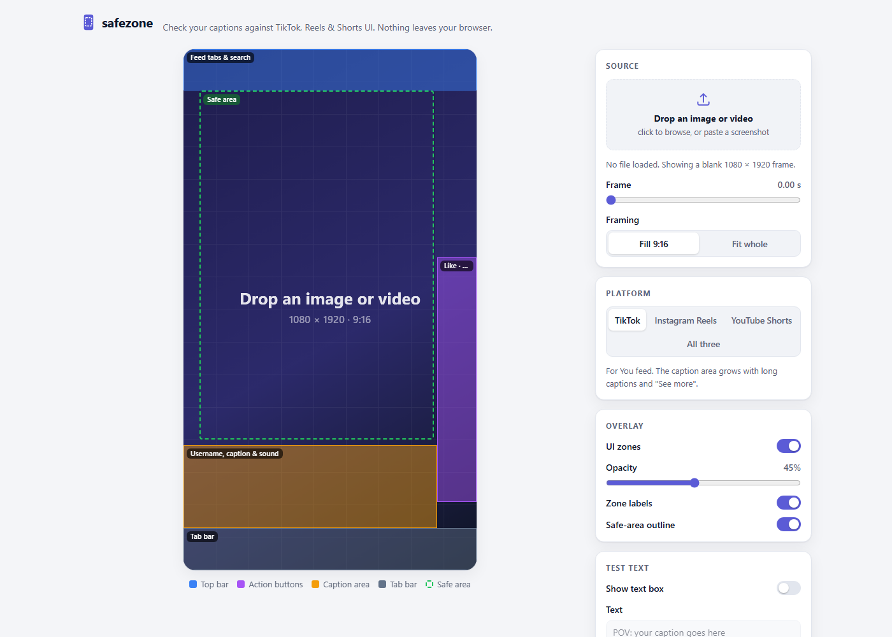

# safezone

A browser tool for short-form video creators. Drop in a frame from your video and see where TikTok, Instagram Reels and YouTube Shorts put their buttons, captions and tab bars on top of it, so your on-screen text doesn't end up underneath them.

**Live demo: https://reelsmith.github.io/safezone/**



## Why

Every vertical video app covers part of the frame with its own UI: feed tabs at the top, a column of like/comment/share buttons on the right, and the username, caption and sound line along the bottom. Text that looks fine in your editor can end up half hidden once it's posted. Each app covers a slightly different area, so text that's clear on one can be covered on another.

safezone gives you a quick visual check before you export. It's a single static page: no account, no upload, no build step. Your files never leave your browser, and it works offline.

## Features

- **Images and videos.** Pick a file, drag and drop it anywhere on the page, or paste a screenshot. For videos, a scrubber lets you choose the frame.
- **9:16 preview** at 1080 × 1920, with *Fill* (crop to 9:16, like the apps do) or *Fit whole* framing.
- **Platform switcher** for TikTok, Instagram Reels and YouTube Shorts, plus an *All three* view whose safe area is the region all of them agree on.
- **Toggleable overlays.** Colour-coded UI zones (top bar, action buttons, caption area, tab bar), an overlay opacity slider, zone labels, and a dashed safe-area outline.
- **Test text box.** Drag it, resize it from the corner, or nudge it with the arrow keys (hold Shift for bigger steps). It turns **red** when it overlaps a UI zone and names the zones it hits, **amber** when it's clear of the UI but outside the recommended margin, and **green** when it's fully inside the safe area.
- **Download PNG.** Exports a full 1080 × 1920 image of the preview with overlays and the text box, handy for sharing with an editor or client.
- Light and dark mode (follows your system setting), responsive down to phone width, and remembers your settings on this device.

## Run locally

Clone or download the repo and open `index.html` in a browser. That's all. There's nothing to install or build, and no external scripts, fonts or network requests.

```
git clone https://github.com/reelsmith/safezone.git
cd safezone
# then open index.html (double-click it, or: start index.html / open index.html / xdg-open index.html)
```

Files:

| File         | What it does                                              |
|--------------|-----------------------------------------------------------|
| `index.html` | Page markup                                               |
| `style.css`  | Styles, light/dark themes                                 |
| `zones.js`   | Platform UI zone definitions (the data)                   |
| `app.js`     | Loading media, drawing overlays, collision check, export  |

## How zones are defined

All platform data lives in [`zones.js`](zones.js), one commented object per platform. Every rectangle is `{ x, y, w, h }` in **percent of a 1080 × 1920 frame**, measured from the top-left corner:

```js
tiktok: {
  name: 'TikTok',
  notes: 'For You feed. The caption area grows with long captions and "See more".',
  updated: '2026-09',
  zones: [
    { id: 'top',  kind: 'top',  label: 'Feed tabs & search', x: 0, y: 0, w: 100, h: 8 },
    { id: 'rail', kind: 'rail', label: 'Like · comment · save · share', x: 86.5, y: 40, w: 13.5, h: 47 },
    // ...
  ],
  safe: { x: 5.5, y: 8, w: 80, h: 67 },
},
```

- `zones` are areas the app's UI covers. `kind` is one of `top`, `rail`, `caption` or `nav` and sets the overlay colour.
- `safe` is the recommended area for important text and faces.
- To convert pixels to percent: `x% = px / 1080 * 100` horizontally and `y% = px / 1920 * 100` vertically.

> **These are approximations.** The apps change their layouts between versions, and the layout also depends on the device, language, caption length, and whether the post is an ad, a Live, or has product tags. None of the platforms publish exact pixel specs for the organic feed. The current numbers are a conservative average of the iOS and Android apps in portrait on a modern tall phone. Leave some margin.

## Contributing updated measurements

If the numbers are off, corrections are very welcome:

1. Take a full-screen screenshot of a post in the app's feed (portrait, no system bars cropped out if possible).
2. Measure each UI area's edges in pixels and convert them to percent of the screenshot's width and height. You can load the screenshot into safezone itself and compare it with the current overlay.
3. Edit the matching entry in `zones.js`: adjust the rectangles, update `safe` if needed, and set `updated` to the current `YYYY-MM`.
4. Open a pull request saying which app version, OS and device you measured on, ideally with the screenshot attached (blur anything personal).

Adding a new platform works the same way: add another entry to `platforms` in `zones.js` and it shows up in the switcher automatically.

Bug reports and other improvements are welcome too. Please keep the project dependency-free and buildless.

## Roadmap

- [ ] Re-measure every zone against real screenshots from current app versions
- [ ] Facebook Reels and Snapchat Spotlight
- [ ] A "long caption" mode for TikTok, where the caption area grows with "See more"
- [ ] Load a `.srt` file and step through each caption line against the zones
- [ ] Share a check as a link, with the platform and text box position in the URL

Found a zone that's off? Open an issue with a screenshot and I'll update it.

## License

[MIT](LICENSE) © 2026 reelsmith
